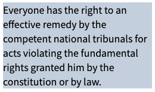
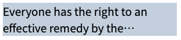

# tailwindcss-line-clamp-no-ellipsis

A tailwind plugin for line clamp without ellipsis.

This tailwind plugin is inspired by [tailwindlabs/tailwindcss-line-clamp](https://github.com/tailwindlabs/tailwindcss-line-clamp/tree/master), which became built-in feature in tailwindcss.

Most of the time, we want to clamp the text with specific number of lines, and adding an ellipsis `...` at the end. But sometimes we just ONLY want to clipped the text WITHOUT ellipsis.

若您的母語為中文，請參閱[中文版文件](readme.zh-tw.md)。

## Demo

|                   | Original                                     | With Ellipsis                                          | Without Ellipsis                                             |
| ----------------- | -------------------------------------------- | ------------------------------------------------------ | ------------------------------------------------------------ |
| Html              | `<div>...</div>`                             | `<div class="line-clamp-2">...</div>`                  | `<div class="line-clamp-no-ellipsis-2">...</div>`            |
| Result (English)  |  |  |  |
| Result (Chinese)  |  |  |  |
| Result (Japanese) |  |       |  |

## Installation

Install the plugin:

```sh
npm install tailwindcss-line-clamp-no-ellipsis
```

Then add the plugin into the `tailwind.config.js`:

```js
module.exports = {
  // ...
  plugins: [
    require('tailwindcss-line-clamp-no-ellipsis'),
    // ...
  ],
  // ...
}
```

## Usage

Use class name `line-clamp-no-ellipsis-{lineNumber}` to define how many lines to truncate.

```html
<div class="line-clamp-no-ellipsis-2">
  Lorem ipsum dolor sit amet consectetur adipisicing elit. Sit eum illum modi nobis nisi similique quasi obcaecati, ipsa eos quaerat.
</div>
```

To remove line clamping, use `line-clamp-no-ellipsis-none`:

```html
<div class="line-clamp-no-ellipsis-2 md:line-clamp-no-ellipsis-none">
  Lorem ipsum dolor sit amet consectetur adipisicing elit. Sit eum illum modi nobis nisi similique quasi obcaecati, ipsa eos quaerat.
</div>
```

The plugin provides 1 ~ 6 lines clamp, the css is generated shown below:

| Class                         | CSS                                                                                     |
| ----------------------------- | --------------------------------------------------------------------------------------- |
| `line-clamp-no-ellipsis-1`    | `overflow: hidden;` <br> `max-height: calc(1lh * 1);` <br> `overflow-wrap: break-word;` |
| `line-clamp-no-ellipsis-2`    | `overflow: hidden;` <br> `max-height: calc(1lh * 2);` <br> `overflow-wrap: break-word;` |
| `line-clamp-no-ellipsis-3`    | `overflow: hidden;` <br> `max-height: calc(1lh * 3);` <br> `overflow-wrap: break-word;` |
| `line-clamp-no-ellipsis-4`    | `overflow: hidden;` <br> `max-height: calc(1lh * 4);` <br> `overflow-wrap: break-word;` |
| `line-clamp-no-ellipsis-5`    | `overflow: hidden;` <br> `max-height: calc(1lh * 5);` <br> `overflow-wrap: break-word;` |
| `line-clamp-no-ellipsis-6`    | `overflow: hidden;` <br> `max-height: calc(1lh * 6);` <br> `overflow-wrap: break-word;` |
| `line-clamp-no-ellipsis-none` | `overflow: unset;` <br> `max-height: unset;`                                            |

## Customization

To use line clamp more then 6 lines, please add custom config in `tailwind.config.js` with `lineClamp` key:

```js
module.exports = {
  theme: {
    extend: {
      lineClamp: {
        7: '7',
        8: '8',
      }
    }
  },
}
```

Then we are good to go!

```html
<div class="line-clamp-no-ellipsis-7">
  Lorem ipsum dolor sit amet consectetur adipisicing elit. Sit eum illum modi nobis nisi similique quasi obcaecati, ipsa eos quaerat.
</div>
```
